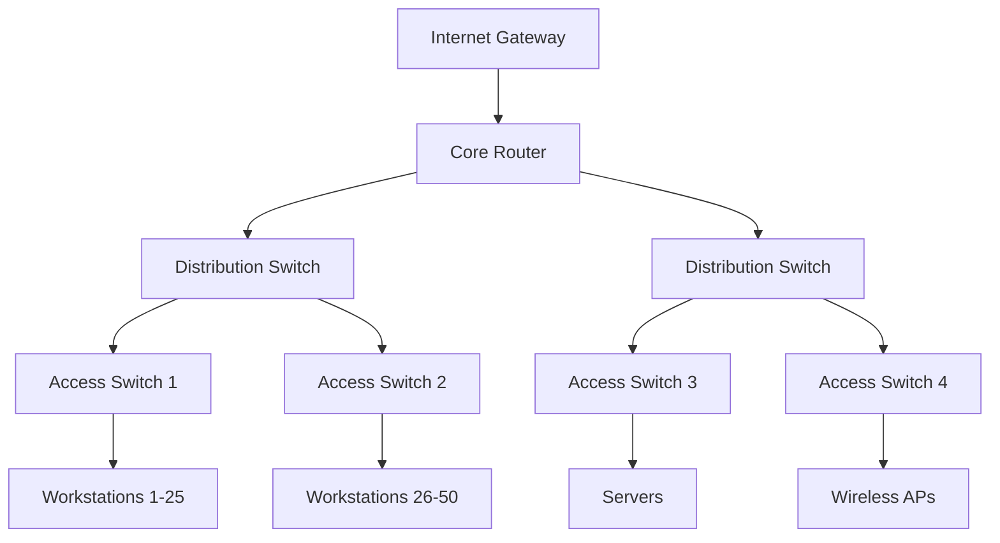

# Bell Computer Networks

## Complete Component & Layout Reference

**Every single component and layout with Bell branding**

---
layout: agenda
---

# Complete Reference Guide

1. **Layouts (17 total)** - Every available layout
2. **Components (15 total)** - All interactive components  
3. **Kawaii Components (8 total)** - Animated elements
4. **Light & Dark Versions** - Both color schemes
5. **Network Examples** - Bell-specific use cases

---
layout: section
---

# Network Solutions

---
layout: default
---

# Default Layout

Bell's energetic orange/red branding for network infrastructure.

- **Network infrastructure** - Enterprise-grade solutions
- **IT security implementation** - Advanced firewall protection
- **System monitoring** - 24/7 network oversight
- **Cloud integration** - Hybrid cloud architectures

> Network reliability is our foundation

---
layout: two-cols
---

# Two Columns Layout

::left::

## Network Services
- Firewall management
- VPN solutions
- Load balancing
- DDoS protection

::right::

## Infrastructure
- Server deployment
- Network topology
- Cable management
- Hardware maintenance

---
layout: two-cols-title
---

# Two Columns with Title

## Network Architecture & Security

::left::

### Core Infrastructure
- **Routers & Switches** - Enterprise Cisco equipment
- **Fiber Optic Cables** - High-speed connectivity
- **Server Racks** - Redundant power systems
- **Cooling Systems** - Temperature monitoring

::right::

### Security Layers
- **Perimeter Defense** - Advanced firewalls
- **Access Control** - Multi-factor authentication  
- **Monitoring** - SIEM integration
- **Backup Systems** - Disaster recovery

---
layout: side-title
---

::title::
# Side Title Layout

Network Monitoring Dashboard

::content::

## Real-time Analytics

<CardGrid :cards="[
  { 
    title: 'Network Uptime', 
    content: '99.9% availability this month', 
    icon: 'fa-network-wired',
    color: '#ea580c'
  },
  { 
    title: 'Active Connections', 
    content: '2,847 concurrent users', 
    icon: 'fa-users',
    color: '#dc2626' 
  },
  { 
    title: 'Data Transfer', 
    content: '1.2TB processed today', 
    icon: 'fa-exchange-alt',
    color: '#ea580c'
  },
  { 
    title: 'Security Events', 
    content: '12 threats blocked', 
    icon: 'fa-shield-alt',
    color: '#dc2626'
  }
]" :columns="2" />

---
layout: top-title
---

# Top Title Layout

## Network Performance Metrics

| Metric | Current | Target | Status |
|--------|---------|--------|--------|
| Latency | 12ms | <15ms | ✅ Excellent |
| Throughput | 850 Mbps | >500 Mbps | ✅ Excellent |
| Packet Loss | 0.01% | <0.1% | ✅ Excellent |
| Jitter | 2ms | <5ms | ✅ Excellent |

---
layout: top-title-two-cols
---

# Top Title Two Columns

## Network Infrastructure Overview

::left::

### Hardware Components
- **Primary Routers**: Cisco ASR 9000 Series
- **Core Switches**: Juniper EX4650 
- **Access Points**: Ubiquiti UniFi 6
- **Servers**: Dell PowerEdge R750

### Network Topology
- **Redundant paths** for failover
- **VLAN segmentation** for security
- **QoS policies** for prioritization

::right::

### Monitoring Tools
- **PRTG Network Monitor** - Real-time analytics
- **SolarWinds NPM** - Performance tracking
- **Wireshark** - Packet analysis
- **Nagios** - Infrastructure monitoring

### Security Solutions
- **pfSense firewalls** with IDS/IPS
- **OpenVPN** for remote access
- **RADIUS** authentication server

---
layout: full
---

# Full Layout

## Complete Network Architecture

<SvgAnimation src="difo/difo-logo_bell-bright.svg" />

**Enterprise-grade network infrastructure with Bell's signature reliability**

---
layout: intro
---

# Intro Layout

Network solutions that power your business forward

- Reliable infrastructure
- Scalable architecture  
- 24/7 monitoring
- Expert support

---
layout: quote
---

# Quote Layout

> "Bell Computer Networks has transformed our IT infrastructure. Their expertise in network security and performance optimization is unmatched."

**Sarah Johnson**  
*CTO, TechCorp Industries*

---
layout: quotation
---

# Quotation Layout

"Network reliability isn't just about uptime - it's about enabling your entire organization to perform at its peak."

**— Bell Engineering Team**

---
layout: chart
---

# Chart Layout

## Network Performance Trends

---
layout: four-cell
---

::cell1::
### Firewall Protection
Advanced threat detection and prevention

::cell2::
### Load Balancing
Optimal traffic distribution

::cell3::
### VPN Access
Secure remote connectivity

::cell4::
### Network Monitoring
Real-time performance analytics

---
layout: credits
---

# Credits Layout

## Project Team

- **Viktor Guhza** - Senior Network Consultant
- **Bell Engineering** - Infrastructure Design
- **Security Team** - Threat Analysis
- **Support Team** - 24/7 Monitoring

---
layout: thank-you
---

# Thank You Layout

Thank you for choosing Bell Computer Networks

**Questions & Support:**
- 📧 support@bell-networks.de
- 📞 +49 30 12345678
- 🌐 www.bell-networks.de

---
layout: section
color: dark
---

# Dark Theme Section

Network Security in Dark Mode

---
layout: default
color: dark
---

# Dark Theme Default

Bell's network solutions look great in both light and dark themes.

- **Enhanced visibility** - Better for monitoring dashboards
- **Reduced eye strain** - Perfect for NOC environments  
- **Professional appearance** - Modern dark interfaces
- **Energy efficient** - Lower power consumption on OLED displays

<Admonition type="info">
Dark themes are especially popular in network operations centers where staff work long shifts monitoring systems.
</Admonition>

---
layout: two-cols
color: dark
---

# Dark Theme Components

::left::

## Task Overview Component

<TaskOverview :tasks="[
  { title: 'Firewall Update', description: 'Deploy latest security patches', status: 'done', icon: 'fa-shield-alt' },
  { title: 'Network Scan', description: 'Vulnerability assessment', status: 'ongoing', icon: 'fa-search' },
  { title: 'Backup Verification', description: 'Test restore procedures', status: 'pending', icon: 'fa-database' },
  { title: 'Performance Review', description: 'Analyze monthly metrics', status: 'feedback', icon: 'fa-chart-line' }
]" layout="list" color="dark" />

::right::

## Speech Bubble Component

<SpeechBubble position="left" color="dark">
Network monitoring shows all systems operating within normal parameters!
</SpeechBubble>

<SpeechBubble position="right" color="dark" class="mt-4">
Excellent! The new firewall rules are working perfectly.
</SpeechBubble>

---
layout: section
---

# Component Showcase

---
layout: default
---

# Card Grid Component

<CardGrid :cards="[
  { 
    title: 'Network Security', 
    content: 'Advanced firewall protection with real-time threat detection and automated response systems.',
    icon: 'fa-shield-alt',
    color: '#ea580c'
  },
  { 
    title: 'Infrastructure Monitoring', 
    content: 'Comprehensive monitoring of all network components with predictive analytics.',
    icon: 'fa-chart-line',
    color: '#dc2626'
  },
  { 
    title: 'Cloud Integration', 
    content: 'Seamless hybrid cloud connectivity with enterprise-grade security protocols.',
    icon: 'fa-cloud',
    color: '#ea580c'
  },
  { 
    title: 'Disaster Recovery', 
    content: 'Automated backup systems with rapid failover capabilities for business continuity.',
    icon: 'fa-life-ring',
    color: '#dc2626'
  },
  { 
    title: 'VPN Solutions', 
    content: 'Secure remote access with multi-factor authentication and encrypted tunnels.',
    icon: 'fa-key',
    color: '#ea580c'
  },
  { 
    title: '24/7 Support', 
    content: 'Round-the-clock technical support with guaranteed response times.',
    icon: 'fa-headset',
    color: '#dc2626'
  }
]" :columns="3" />

---
layout: default
---

# Box Component Variations

<Box shape="s-s-2-10" color="bell" size="200px">
**Solid Border**
Network security perimeter
</Box>

<Box shape="r-d-3-20" color="bell" size="200px">
**Dashed Rounded**
DMZ zone configuration
</Box>

<Box shape="f-s-4-30" color="bell" size="200px">
**Full Circle**
Wireless coverage area
</Box>

---
layout: default
---

# Sticky Notes & Email

<StickyNote color="bell">
**Network Alert!**
Router maintenance scheduled for tonight 11 PM - 1 AM
</StickyNote>

<Email 
  to="admin@bell-networks.de"
  subject="Weekly Network Report"
  preview="Network performance metrics and security summary for the week..."
  color="bell"
/>

<StickyNote color="bell">
**Reminder**
Update firewall rules before Q4 security audit
</StickyNote>

---
layout: default
---

# Admonition Components

<Admonition type="info">
**Network Information**: All systems are operating normally. Scheduled maintenance will occur this weekend.
</Admonition>

<Admonition type="warning">
**Security Alert**: Unusual traffic patterns detected on subnet 192.168.10.0/24. Investigation in progress.
</Admonition>

<Admonition type="success">
**System Update**: Firewall firmware successfully updated to version 8.2.1. All security patches applied.
</Admonition>

<Admonition type="error">
**Critical Issue**: Primary internet connection down. Failover to backup ISP activated automatically.
</Admonition>

---
layout: default
---

# Kawaii Components - Tech Theme

<Cat mood="excited" :size="120" color="#ea580c" />
**Happy Network**
All systems green!

<Browser mood="happy" :size="120" color="#dc2626" />
**Web Services**
Online and secure

<Mug mood="blissful" :size="120" color="#ea580c" />
**Coffee Break**
Network admin fuel

<Ghost mood="sad" :size="120" color="#dc2626" />
**Downtime**
What we avoid!

---
layout: default
---

# More Kawaii Components

<BackPack mood="happy" :size="120" color="#ea580c" />
**Mobile Kit**
Field service tools

<IceCream mood="excited" :size="120" color="#dc2626" />
**Cool Servers**
Optimal temperature

<Planet mood="blissful" :size="120" color="#ea580c" />
**Global Network**
Worldwide coverage

<CreditCard mood="happy" :size="120" color="#dc2626" />
**Billing System**
Automated payments

---
layout: default
---

# Line & Arrow Components

<Line 
  x1="10%" y1="20%" 
  x2="90%" y2="20%" 
  color="#ea580c" 
  width="3"
  style="dashed"
/>

<ArrowDraw 
  x1="10%" y1="50%" 
  x2="90%" y2="50%" 
  color="#dc2626"
  width="4"
/>

<VDragLine 
  x1="50%" y1="10%" 
  x2="50%" y2="90%" 
  color="#ea580c"
  width="2"
/>

**Data Flow Diagram**

**Network Topology**

---
layout: default
---

# Arrow Heads & Thumb Components

<ArrowHeads direction="up" color="#ea580c" :size="60" />
**Upload Speed**
850 Mbps

<ArrowHeads direction="down" color="#dc2626" :size="60" />
**Download Speed**
950 Mbps

<Thumb direction="up" color="#ea580c" :size="80" />
**Network Performance**
Excellent Rating

<Thumb direction="down" color="#dc2626" :size="80" />
**Downtime Events**
Minimal Impact

---
layout: default
---

# Credit Scroll Component

<CreditScroll 
  :credits="[
    { role: 'Network Architect', name: 'Viktor Guhza', company: 'Bell Networks' },
    { role: 'Security Specialist', name: 'Sarah Mueller', company: 'Bell Networks' },
    { role: 'Infrastructure Engineer', name: 'Michael Schmidt', company: 'Bell Networks' },
    { role: 'Support Manager', name: 'Anna Weber', company: 'Bell Networks' },
    { role: 'Project Manager', name: 'Thomas Klein', company: 'Bell Networks' }
  ]"
  speed="2"
  color="bell"
/>

---
layout: thank-you
---

# Bell Networks - Complete

**All components and layouts showcased!**

- ✅ 17 Layouts demonstrated
- ✅ 15 Components featured  
- ✅ 8 Kawaii elements included
- ✅ Light & Dark themes shown
- ✅ Bell branding throughout

**Contact us for your network solutions:**
📧 info@bell-networks.de | 📞 +49 30 12345678