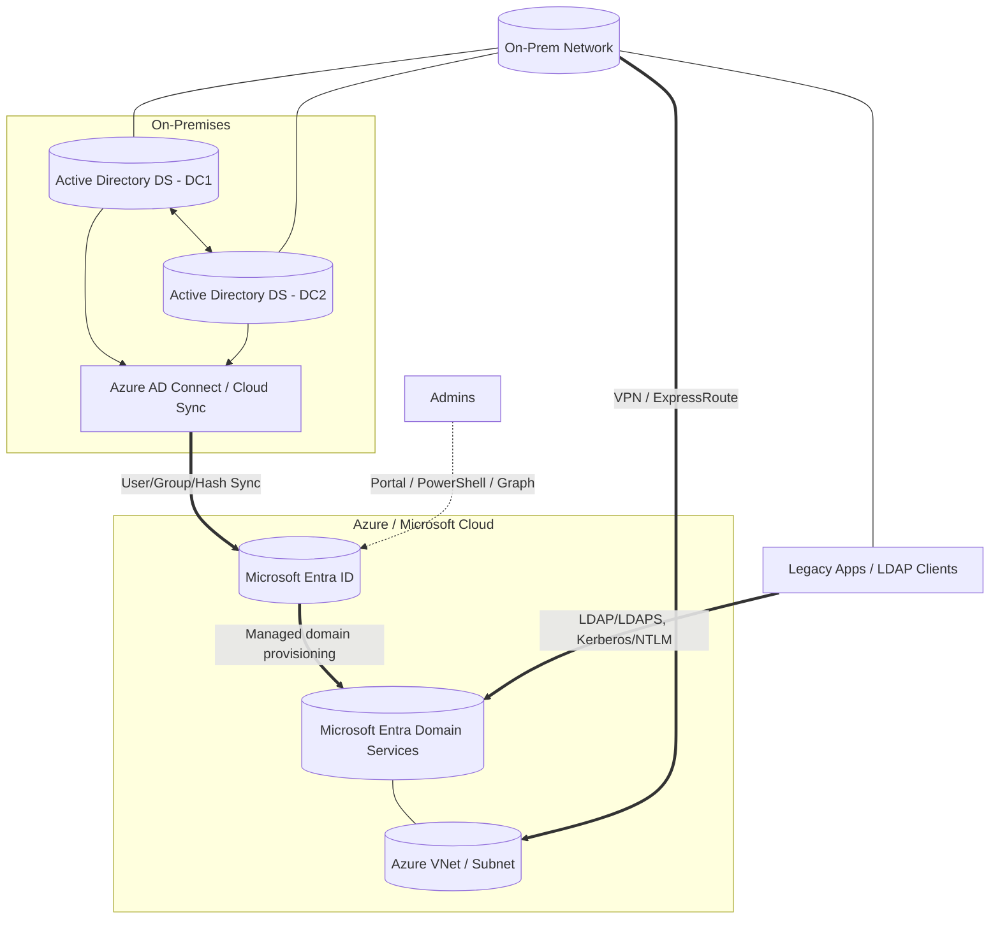

---
layout: cards-grid
color: dark
cards:
  - headline: "Vereinheitlichung"
    content: "Zusammenarbeit über Unternehmensgrenzen hinweg ermöglichen"
    icon: "fas fa-network-wired"
    color: "#3b82f6" # Blau für Vernetzung
  - headline: "Optimierung"
    content: "Reduzierung der Arbeitslast in der internen Administration"
    icon: "fas fa-cogs"
    color: "#10b981" # Grün für Effizienz
  - headline: "Enablement"
    content: "Zugewinn neuer Funktionen und Möglichkeiten"
    icon: "fas fa-lightbulb"
    color: "#facc15" # Gelb für Innovation/Ideen
theme: "dark"
sequential: true
---

# ZIELE
## Was wollen wir erreichen

---
layout: cards-grid
color: light
cards:
  - headline: "Tenants"
    content: "Zusammenlegen der Tenants auf einen einheitlichen DiFo-Tenant; Gleichzeitig muss eine Trennung möglich sein."
    icon: "fas fa-network-wired"
    color: "#424d90"
  - headline: "Mailboxen"
    content: "Jeder Mitarbeiter hat eine difo.de sowie eine cms-it.de und/oder bell.de Adresse"
    icon: "fas fa-envelope"
    color: "#424d90"
  - headline: "Kalender"
    content: "Gemeinsame Kalender auf Difo-Ebene"
    icon: "fas fa-calendar-alt"
    color: "#424d90"
  - headline: "Teams"
    content: "Mitarbeiter sollen horizontal miteinander Zusammenarbeiten können"
    icon: "fas fa-users"
    color: "#424d90"
  - headline: "Lizenzierung"
    content: "Welche Lizenzen gibt es bzw werden benötigt"
    icon: "fas fa-id-card"
    color: "#424d90"
  - headline: "MDM und Auto-Pilot"
    content: "Werkzeuge zur Device Verwaltung"
    icon: "fas fa-mobile-alt"
    color: "#424d90"
  - headline: "Compliance"
    content: "Berücksichtigung von Compliance und Gov-Requirements"
    icon: "fas fa-balance-scale"
    color: "#424d90"
  - headline: "Dateiverwaltung"
    content: "Ablage und Sharing via OneDrive, Sharepoint, o.ä."
    icon: "fas fa-file"
    color: "#424d90"
theme: "light"
sequential: false
---

# THEMEN

---
layout: two-cols-full
title: Test
color: light
columns: is-5-7
---

:: left ::

# Active Directory

- Welche Services on Prem benötigen ein lokales Active Directory
  - Client-Zertifikate für NAC
  - LDAP
  - SAML
  - File-Server
  - Windows CA
- Alternativen:
  - Entra Only
  - Hybrid Join
  - Autopilot

:: right ::

---
layout: two-cols-full
title: Test
color: light
columns: is-6-6
---

:: left ::

# Features und Funktionen

* Siehe: m365maps.com
* Power-Plattform: PowerAutomate, PowerBi

:: right ::

---
layout: two-cols-full
title: Test
color: light
columns: is-6-6
---

:: left ::

# Tenants

* Erstellen eines komplett neuen Tenants für difo.de
* Zentrale 

:: right ::

---
layout: two-cols-full
title: Test
color: light
columns: is-7-5
---

:: left ::

# Dateiverwaltung
## Grundsätzliche Überlegungen

* Lokale File Server vs. OneDrive/Sharepoint

:: right ::

---
layout: two-cols-full
title: Test
color: light
columns: is-6-6
---

:: left ::

# File Share
## Lokal

* Langlebig
* Mit Backup und Snapshots
* Wird nicht indexiert
  
:: right ::

# SharePoint
## bzw. OneDrive über Teams Teams

* Kurzlebig
* Indexiert und Durchsuchbar
* Teams Teams werden irgendwann komplett archiviert (Channels können nicht archiviert werden)
* Archive Storage kosten weniger pro GB
* Löschen und Archivierung kann automatisiert werden
* Jedes Team erhält autom. eine eigene Mail Adresse basierend auf dem Teams Namen

---
layout: two-cols-full
title: Test
color: light
columns: is-7-5
---

:: left ::

# Automatisierung

* Automatisierung per MS Forms und PowerAutomate
* Workflows zum Anlegen von Postfächern, Nutzern, etc.
* Anlegen von Teams (z.B. für Projekte, Vertriebsthemen, etc.)

:: right ::

---
layout: default
---

# Notizen
## Intern

* Automatisches Labeling (z.B. per AI) per DocFlow
* Martin wg. difo.de DNS config (SPF record)
* Postfach und Konfig für meet@difo.de
* Rollout von Proofpoint auch zu Bell
* https://cmsitconsulting-admin.sharepoint.com