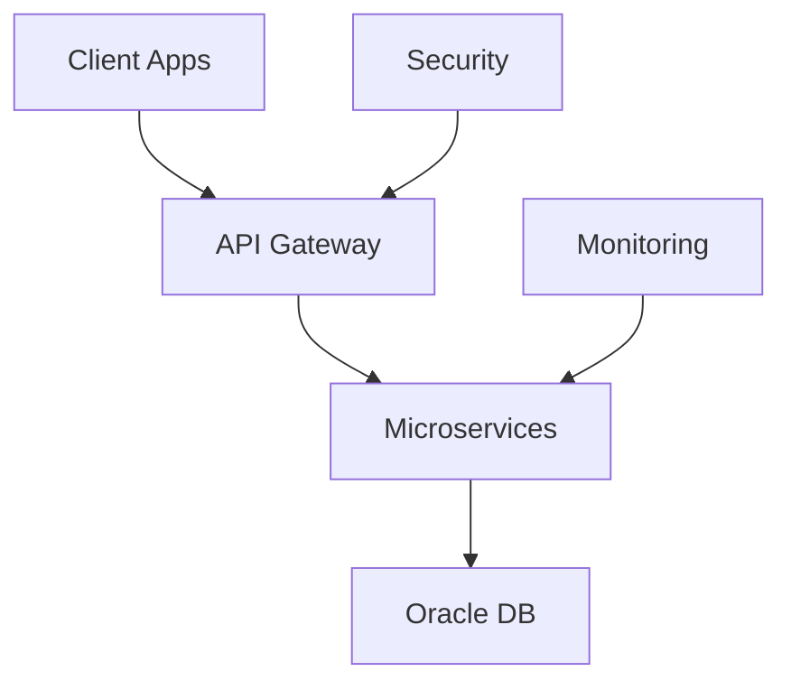
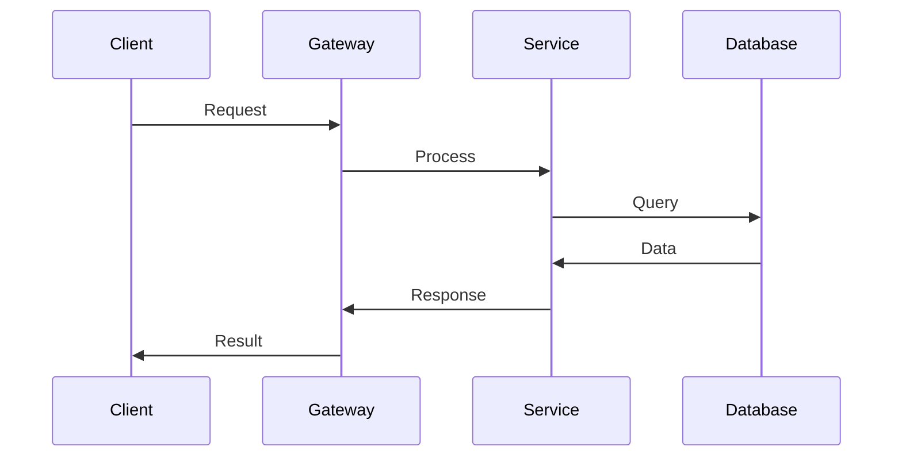

<link rel="stylesheet" href="bell/styles.css">

# BELL DIGITAL SOLUTIONS

Professional IT Consulting & Services

---
layout: section
color: dark
---

# ENTERPRISE SOLUTIONS
<hr>

Professional IT Services for Modern Business

---
layout: default
color: light
---

# ABOUT BELL

- **IT Consulting** - Strategic Technology Advisory
- **Cloud Services** - Modern Infrastructure Solutions  
- **Digital Transformation** - End-to-End Projects
- **24/7 Support** - Continuous Service Excellence

<div class="bell-card">
<h3>Enterprise Focus</h3>
<p>Scalable solutions for complex business requirements</p>
</div>

---
layout: two-cols-title
title: 'Our Services'
columns: is-6
align: l-lt-lt
color: dark
---

::title::

# OUR SERVICES

::left::

## Consulting
- **IT Strategy** - Long-term Planning
- **Architecture Review** - System Analysis
- **Risk Assessment** - Security Evaluation

::right::

## Implementation
- **System Integration** - Seamless Connectivity
- **Cloud Migration** - Secure Transitions
- **Training Programs** - Knowledge Transfer

---
layout: side-title
side: l
titlewidth: is-4
align: rm-lm
title: Technology Stack
color: light
---

::title::

# <mdi-code-braces /> TECH STACK

**Enterprise Grade**

::content::

Bell Platform Overview:

```javascript
const bellStack = {
  backend: "Spring Boot + Oracle",
  frontend: "Angular + Material",
  cloud: "Microsoft Azure",
  security: "OAuth 2.0 + JWT"
};

console.log("Bell Enterprise Ready");
```

**Key Technologies:**
- Spring Boot Framework
- Angular 17
- Azure Cloud Platform
- Oracle Database

---
layout: quote
author: 'Thomas Weber, CEO Bell'
quotesize: text-xl
authorsize: text-lg
color: dark
---

"We combine proven enterprise technologies with innovative approaches to deliver sustainable business results."

---
layout: full
title: Success Stories
color: light
---

<div class="v-full h-full p-8">

# SUCCESS STORIES

<div class="grid grid-cols-3 gap-6 mt-8">

<div class="bell-card">
<h3>Banking Group</h3>
<p>• Digital Platform<br/>• 500% Performance Boost<br/>• PCI DSS Compliant</p>
</div>

<div class="bell-card">
<h3>Government Portal</h3>
<p>• 1M+ Citizens<br/>• GDPR Compliant<br/>• 24/7 Availability</p>
</div>

<div class="bell-card">
<h3>Healthcare System</h3>
<p>• 200+ Clinics<br/>• HIPAA Compliant<br/>• AI Analytics</p>
</div>

</div>

</div>

---
layout: image-left
image: /bell/difo-logo_bell-color.svg
color: dark
---

# SECURITY CENTER

## Cybersecurity Excellence

Comprehensive security solutions for critical business infrastructure.

**Services:**
- **Penetration Testing** - Security Audits
- **SOC Services** - 24/7 Monitoring
- **Compliance** - Regulatory Standards
---
layout: two-cols-title
title: 'Bell Methodology'
columns: is-one-half
align: c-lt-lt
color: light
titlepos: t
---

::title::

# BELL METHODOLOGY

::left::

## Project Phases
1. **Discovery** - Requirements Analysis
2. **Design** - Architecture Planning
3. **Development** - Iterative Building
4. **Testing** - Quality Assurance
5. **Deployment** - Go-Live Support

::right::

## Core Principles
- **Agile Development** - Iterative delivery
- **Risk-driven Approach** - Proactive planning
- **Stakeholder Collaboration** - Continuous engagement
- **Quality Assurance** - Comprehensive testing
- **Continuous Improvement** - Lessons learned

---
layout: top-title-two-cols
columns: is-6
align: l-lt-lt
title: Our Team
color: dark
---

::title::

# OUR TEAM

::left::

## Expertise
<div class="bell-card">
<h3>Senior Consultants</h3>
<p>10+ years experience in enterprise solutions</p>
</div>

::right::

## Locations
<div class="bell-card">
<h3>Germany</h3>
<p>Hamburg • Munich • Frankfurt • Berlin</p>
</div>

---
layout: default
title: Resources
color: light
---

# RESOURCES & SUPPORT

## Documentation & Support

<div class="grid grid-cols-2 gap-8">

<div>
### Bell Documentation
<QRCode value="https://docs.bell-digital.com" :size="120" render-as="svg" />
</div>

<div>
### Support Portal  
<QRCode value="https://support.bell-digital.com" :size="120" render-as="svg" />
</div>

</div>

**24/7 Support:** +49 (0) 40 123-456

---
layout: default
title: Team
color: dark
---

# PROJECT TEAM

<div class="text-center">

## Your Contacts

<IceCream :size="80" mood="happy" color="#2b3681" />
<BackPack :size="80" mood="excited" color="#23438c" />
<Cat :size="80" mood="blissful" color="#797d82" />

**Project Lead:** Dr. Michael Schneider  
**Technical Lead:** Anna Müller  
**Security Officer:** Robert Klein

</div>

---
layout: two-cols-title
title: 'System Architecture'
columns: is-one-half
align: c-lt-lt
color: light
titlepos: t
---

::title::

# SYSTEM ARCHITECTURE

::left::



::right::

## Architecture Principles

- **Microservices Design** - Modular components
- **API-first Approach** - Service interfaces
- **Security by Design** - Built-in protection
- **Scalable Infrastructure** - Growth-ready
- **Monitoring Integration** - Real-time insights
- **High Availability** - 99.9% uptime

---
layout: side-title
side: r
color: dark
titlewidth: is-6
align: lm-lb
title: Data Flow
---

::title::

# DATA FLOW

::content::



---
layout: cover
color: light
---

# Bell Digital Solutions

**Enterprise IT Consulting**   
_Trusted Technology Partner_

:: note ::

Professional services with enterprise-grade security and reliability.

---
layout: intro
color: indigo-light
---

# Bell Professional Services

**Enterprise IT Consulting**   
_Hamburg • Munich • Frankfurt • Berlin_

<br />

Your trusted partner for digital transformation and enterprise technology solutions.

---
layout: section
color: dark
---

# ENTERPRISE EXCELLENCE
<hr>

Delivering professional IT solutions with proven methodologies.

---
layout: quote
color: light
quotesize: text-lg
authorsize: text-md
author: "Bell Digital Solutions"
---

"Excellence in enterprise IT consulting through proven methodologies and innovative solutions."

---
layout: full
color: dark
title: Bell Enterprise
---

<div class='v-full h-full p-8'>

# BELL ENTERPRISE PLATFORM

<div class="bell-card">
<h3>Core Technologies</h3>
<p>Spring Boot • Angular • Azure • Oracle Database</p>
</div>

<div class="bell-card">
<h3>Security Standards</h3>
<p>ISO 27001 • SOC 2 • OAuth 2.0 • End-to-End Encryption</p>
</div>

</div>

---
layout: image-right
image: /bell/difo-logo_bell-bright.svg
color: light
---

# Bell Innovation

## Future-Ready Solutions

Bell combines traditional enterprise reliability with modern innovation approaches.

**Focus Areas:**
- Cloud-Native Architecture
- Microservices Design
- DevSecOps Practices
- AI/ML Integration

---
layout: two-cols-title
columns: is-6
align: l-lt-lt
title: Bell Methodology
color: dark
---

:: title ::

# BELL METHODOLOGY

:: left ::

## Approach
- **Agile Development** - Iterative delivery
- **Risk Management** - Proactive planning
- **Quality Assurance** - Comprehensive testing

:: right ::

## Results
- **On-Time Delivery** - 95% success rate
- **Budget Compliance** - Cost-effective solutions
- **Client Satisfaction** - Long-term partnerships

---
layout: side-title
side: l
color: light
titlewidth: is-4
align: rm-lm
title: Bell Code
---

:: title ::

# <mdi-code-braces /> CODE

**Enterprise Java**

:: content ::

Professional Spring Boot implementation:

```java
@RestController
@RequestMapping("/api/bell")
public class BellController {
    
    @GetMapping("/status")
    public ResponseEntity<String> status() {
        return ResponseEntity.ok("Bell System Online");
    }
}
```

**Features:**
- RESTful APIs
- Security Integration
- Performance Monitoring
- Error Handling

---
layout: default
title: Bell Contact
color: dark
---

# CONTACT BELL

## Get In Touch

**Bell Digital Solutions GmbH**  
Speicherstadt 1, 20457 Hamburg

**Contact:**
- **Phone:** +49 (0) 40 123 456-789
- **Email:** info@bell-digital.com
- **Web:** bell-digital.com

**Social:**
- LinkedIn: /company/bell-digital
- Xing: /company/bell-solutions

---
layout: credits
---

# BELL DIGITAL SOLUTIONS

**Professional IT Consulting & Enterprise Services**  
Delivering excellence in digital transformation

## Contact Information

- **Website:** [bell-digital.com](https://bell-digital.com)
- **Email:** info@bell-digital.com  
- **Phone:** +49 (0) 40 123 456-789

## Office Locations

- **Hamburg:** Speicherstadt 1 (Headquarters)
- **Munich:** Maximilianstraße 12
- **Frankfurt:** Taunusanlage 8
- **Berlin:** Unter den Linden 15

<div class="absolute bottom-10 right-10">
  
</div>