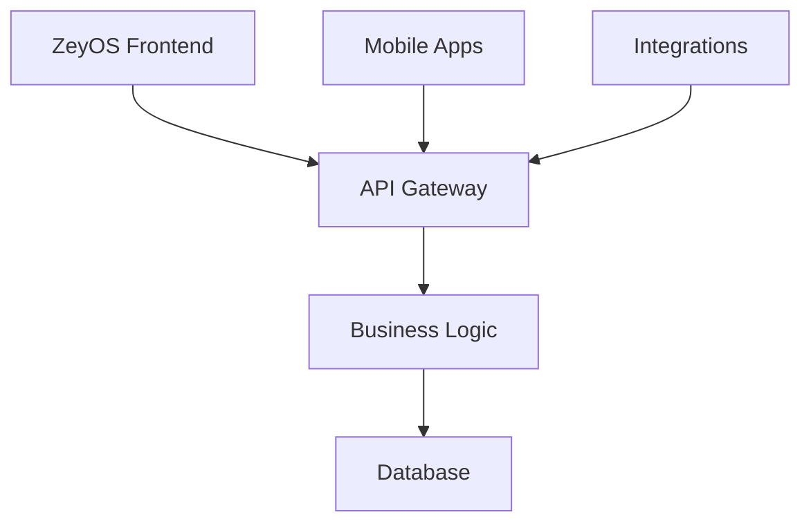
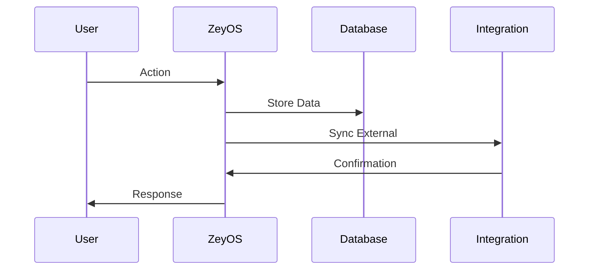

<link rel="stylesheet" href="zeyos/styles.css">

# ZEYOS BUSINESS SOLUTIONS

Complete ERP & CRM Platform

---
layout: default
color: light
---

# ZEYOS BUSINESS SOLUTIONS

Complete ERP & CRM Platform

---
layout: cover
color: dark
---

# BUSINESS EXCELLENCE
<hr>

Integrated solutions for modern enterprises

---
layout: section
color: light
---

# BUSINESS EXCELLENCE
<hr>

Integrated solutions for modern enterprises

---
layout: default
color: dark
---

# ABOUT ZEYOS

- **ERP System** - Complete business management
- **CRM Platform** - Customer relationship excellence
- **Cloud-Based** - Modern SaaS architecture
- **German Engineering** - GDPR compliant & secure

<div class="zeyos-card">
<h3>All-in-One Solution</h3>
<p>ERP, CRM, and project management in one platform</p>
</div>

---
layout: default
color: light
---

# ABOUT ZEYOS

- **ERP System** - Complete business management
- **CRM Platform** - Customer relationship excellence
- **Cloud-Based** - Modern SaaS architecture
- **German Engineering** - GDPR compliant & secure

<div class="zeyos-card">
<h3>All-in-One Solution</h3>
<p>ERP, CRM, and project management in one platform</p>
</div>

---
layout: two-cols-title
title: 'ZeyOS Modules'
columns: is-one-half
align: c-lt-lt
color: dark
titlepos: t
---

::title::

# ZEYOS MODULES

::left::

## Core Business
- **Customer Management** - Complete CRM
- **Sales Pipeline** - Opportunity tracking
- **Project Management** - Resource planning
- **Financial Management** - Accounting integration

::right::

## Advanced Features
- **Inventory Management** - Stock control
- **Document Management** - File organization
- **Reporting & Analytics** - Business insights
- **Mobile Access** - iOS & Android apps

---
layout: two-cols-title
title: 'ZeyOS Modules'
columns: is-one-half
align: c-lt-lt
color: light
titlepos: t
---

::title::

# ZEYOS MODULES

::left::

## Core Business
- **Customer Management** - Complete CRM
- **Sales Pipeline** - Opportunity tracking
- **Project Management** - Resource planning
- **Financial Management** - Accounting integration

::right::

## Advanced Features
- **Inventory Management** - Stock control
- **Document Management** - File organization
- **Reporting & Analytics** - Business insights
- **Mobile Access** - iOS & Android apps

---
layout: side-title
side: l
titlewidth: is-4
align: rm-lm
title: ZeyOS API
color: dark
---

::title::

# <mdi-code-braces /> ZEYOS API

**RESTful Integration**

::content::

ZeyOS API Integration:

```javascript
const zeyos = new ZeyOSClient({
  endpoint: 'https://api.zeyos.com',
  apiKey: process.env.ZEYOS_API_KEY
});

// Customer sync
const customers = await zeyos.customers.list({
  limit: 50,
  fields: ['name', 'email', 'status']
});

console.log(`Found ${customers.length} customers`);
```

**API Features:**
- RESTful endpoints
- Real-time webhooks
- Comprehensive documentation

---
layout: side-title
side: l
titlewidth: is-4
align: rm-lm
title: ZeyOS API
color: light
---

::title::

# <mdi-code-braces /> ZEYOS API

**RESTful Integration**

::content::

ZeyOS API Integration:

```javascript
const zeyos = new ZeyOSClient({
  endpoint: 'https://api.zeyos.com',
  apiKey: process.env.ZEYOS_API_KEY
});

// Customer sync
const customers = await zeyos.customers.list({
  limit: 50,
  fields: ['name', 'email', 'status']
});

console.log(`Found ${customers.length} customers`);
```

**API Features:**
- RESTful endpoints
- Real-time webhooks
- Comprehensive documentation

---
layout: quote
author: 'ZeyOS Development Team'
quotesize: text-xl
authorsize: text-lg
color: dark
---

"ZeyOS combines the power of ERP and CRM in one intuitive platform, designed for the modern digital workplace."

---
layout: quote
author: 'ZeyOS Development Team'
quotesize: text-xl
authorsize: text-lg
color: light
---

"ZeyOS combines the power of ERP and CRM in one intuitive platform, designed for the modern digital workplace."

---
layout: full
title: ZeyOS Success Stories
color: dark
---

<div class="v-full h-full p-8">

# ZEYOS SUCCESS STORIES

<div class="grid grid-cols-3 gap-6 mt-8">

<div class="zeyos-card">
<h3>Manufacturing</h3>
<p>• 500+ Employees<br/>• Inventory Optimization<br/>• 40% Efficiency Gain</p>
</div>

<div class="zeyos-card">
<h3>Service Company</h3>
<p>• Project Management<br/>• Resource Planning<br/>• 60% Time Savings</p>
</div>

<div class="zeyos-card">
<h3>Retail Chain</h3>
<p>• Multi-location CRM<br/>• Sales Analytics<br/>• 200% Growth Support</p>
  </div>

  </div>

</div>

---
layout: full
title: ZeyOS Success Stories
color: light
---

<div class="v-full h-full p-8">

# ZEYOS SUCCESS STORIES

<div class="grid grid-cols-3 gap-6 mt-8">

<div class="zeyos-card">
<h3>Manufacturing</h3>
<p>• 500+ Employees<br/>• Inventory Optimization<br/>• 40% Efficiency Gain</p>
</div>

<div class="zeyos-card">
<h3>Service Company</h3>
<p>• Project Management<br/>• Resource Planning<br/>• 60% Time Savings</p>
</div>

<div class="zeyos-card">
<h3>Retail Chain</h3>
<p>• Multi-location CRM<br/>• Sales Analytics<br/>• 200% Growth Support</p>
</div>

</div>

</div>

---
layout: image-left
image: /zeyos/logo-black.svg
color: dark
---

# ZEYOS CLOUD PLATFORM

## Scalable & Secure

ZeyOS runs entirely in the cloud with enterprise-grade security and reliability.

**Cloud Benefits:**
- **No Installation** - Ready to use immediately
- **Automatic Updates** - Always latest version
- **Scalable** - Grows with your business
- **Secure** - Enterprise encryption

**Performance:**
- 99.9% uptime guarantee
- Global CDN delivery
- Real-time synchronization

---
layout: image-left
image: /zeyos/logo-black.svg
color: light
---

# ZEYOS CLOUD PLATFORM

## Scalable & Secure

ZeyOS runs entirely in the cloud with enterprise-grade security and reliability.

**Cloud Benefits:**
- **No Installation** - Ready to use immediately
- **Automatic Updates** - Always latest version
- **Scalable** - Grows with your business
- **Secure** - Enterprise encryption

**Performance:**
- 99.9% uptime guarantee
- Global CDN delivery
- Real-time synchronization

---
layout: two-cols-title
title: 'Implementation Process'
columns: is-one-half
align: c-lt-lt
color: dark
titlepos: t
---

::title::

# IMPLEMENTATION PROCESS

::left::

## Setup Phase
1. **Configuration** - System setup
2. **Data Import** - Existing data migration
3. **User Setup** - Account creation
4. **Training** - Team onboarding

::right::

## Go-Live Support
- **Testing Period** - Pilot user group
- **Feedback Integration** - System refinement
- **Full Rollout** - Company-wide deployment
- **Ongoing Support** - Continuous assistance

---
layout: two-cols-title
title: 'Implementation Process'
columns: is-one-half
align: c-lt-lt
color: light
titlepos: t
---

::title::

# IMPLEMENTATION PROCESS

::left::

## Setup Phase
1. **Configuration** - System setup
2. **Data Import** - Existing data migration
3. **User Setup** - Account creation
4. **Training** - Team onboarding

::right::

## Go-Live Support
- **Testing Period** - Pilot user group
- **Feedback Integration** - System refinement
- **Full Rollout** - Company-wide deployment
- **Ongoing Support** - Continuous assistance

---
layout: top-title-two-cols
columns: is-one-half
align: l-lt-lt
title: ZeyOS Pricing
color: dark
---

::title::

# ZEYOS PRICING

::left::

## Starter Plan
<div class="zeyos-card">
<h3>€29/month per user</h3>
<p>• Basic CRM features<br/>• 5GB storage<br/>• Email support</p>
</div>

::right::

## Professional Plan
<div class="zeyos-card">
<h3>€49/month per user</h3>
<p>• Full ERP & CRM<br/>• 50GB storage<br/>• Phone support</p>
</div>

---
layout: top-title-two-cols
columns: is-one-half
align: l-lt-lt
title: ZeyOS Pricing
color: light
---

::title::

# ZEYOS PRICING

::left::

## Starter Plan
<div class="zeyos-card">
<h3>€29/month per user</h3>
<p>• Basic CRM features<br/>• 5GB storage<br/>• Email support</p>
</div>

::right::

## Professional Plan
<div class="zeyos-card">
<h3>€49/month per user</h3>
<p>• Full ERP & CRM<br/>• 50GB storage<br/>• Phone support</p>
</div>

---
layout: default
title: ZeyOS Resources
color: dark
---

# ZEYOS RESOURCES

## Documentation & Training

<div class="grid grid-cols-2 gap-8">

<div>
### ZeyOS Help Center
<QRCode value="https://help.zeyos.com" :size="120" render-as="svg" />
</div>

<div>
### ZeyOS Academy  
<QRCode value="https://academy.zeyos.com" :size="120" render-as="svg" />
</div>

</div>

**Support:** support@zeyos.com • +49 (0) 89 123-456

---
layout: default
title: ZeyOS Resources
color: light
---

# ZEYOS RESOURCES

## Documentation & Training

<div class="grid grid-cols-2 gap-8">

<div>
### ZeyOS Help Center
<QRCode value="https://help.zeyos.com" :size="120" render-as="svg" />
</div>

<div>
### ZeyOS Academy  
<QRCode value="https://academy.zeyos.com" :size="120" render-as="svg" />
</div>

</div>

**Support:** support@zeyos.com • +49 (0) 89 123-456

---
layout: default
title: ZeyOS Team
color: dark
---

# ZEYOS PROJECT TEAM

<div class="text-center">

## Your Implementation Team

<IceCream :size="80" mood="happy" color="#0066cc" />
<BackPack :size="80" mood="excited" color="#004499" />
<Cat :size="80" mood="blissful" color="#0088ff" />

**Implementation Manager:** Lisa Weber  
**Technical Consultant:** Marcus Schmidt  
**Training Specialist:** Sarah Klein

</div>

---
layout: default
title: ZeyOS Team
color: light
---

# ZEYOS PROJECT TEAM

<div class="text-center">

## Your Implementation Team

<IceCream :size="80" mood="happy" color="#0066cc" />
<BackPack :size="80" mood="excited" color="#004499" />
<Cat :size="80" mood="blissful" color="#0088ff" />

**Implementation Manager:** Lisa Weber  
**Technical Consultant:** Marcus Schmidt  
**Training Specialist:** Sarah Klein

</div>

---
layout: two-cols-title
title: 'System Architecture'
columns: is-one-half
align: c-lt-lt
color: dark
titlepos: t
---

::title::

# ZEYOS ARCHITECTURE

::left::



::right::

## Technical Stack

- **Frontend** - Modern web application
- **Backend** - Scalable microservices
- **Database** - High-performance storage
- **Security** - End-to-end encryption
- **APIs** - RESTful integration
- **Mobile** - Native iOS/Android apps

---
layout: two-cols-title
title: 'System Architecture'
columns: is-one-half
align: c-lt-lt
color: light
titlepos: t
---

::title::

# ZEYOS ARCHITECTURE

::left::


::right::

## Technical Stack

- **Frontend** - Modern web application
- **Backend** - Scalable microservices
- **Database** - High-performance storage
- **Security** - End-to-end encryption
- **APIs** - RESTful integration
- **Mobile** - Native iOS/Android apps

---
layout: side-title
side: r
color: dark
titlewidth: is-6
align: lm-lb
title: Data Flow
---

::title::

# DATA FLOW

::content::



---
layout: side-title
side: r
color: light
titlewidth: is-6
align: lm-lb
title: Data Flow
---

::title::

# DATA FLOW

::content::


---
layout: intro
color: dark
---

# ZeyOS Enterprise Solutions

**ERP • CRM • Project Management**   
_Munich • Berlin • Hamburg_

<br />

Your complete business management solution in the cloud.

---
layout: intro
color: light
---

# ZeyOS Enterprise Solutions

**ERP • CRM • Project Management**   
_Munich • Berlin • Hamburg_

<br />

Your complete business management solution in the cloud.

---
layout: default
title: ZeyOS Contact
color: dark
---

# CONTACT ZEYOS

## Get Started Today

**ZeyOS GmbH**  
Maximilianstraße 35, 80539 München

**Contact:**
- **Phone:** +49 (0) 89 123 456-789
- **Email:** info@zeyos.com
- **Web:** zeyos.com

**Social:**
- LinkedIn: /company/zeyos
- Twitter: @zeyos_official

---
layout: default
title: ZeyOS Contact
color: light
---

# CONTACT ZEYOS

## Get Started Today

**ZeyOS GmbH**  
Maximilianstraße 35, 80539 München

**Contact:**
- **Phone:** +49 (0) 89 123 456-789
- **Email:** info@zeyos.com
- **Web:** zeyos.com

**Social:**
- LinkedIn: /company/zeyos
- Twitter: @zeyos_official

---
layout: credits
---

# ZEYOS BUSINESS SOLUTIONS

**Complete ERP & CRM Platform**  
Made in Germany for global businesses

## Contact Information

- **Website:** [zeyos.com](https://zeyos.com)
- **Email:** info@zeyos.com  
- **Phone:** +49 (0) 89 123 456-789

## Office Locations

- **Munich:** Maximilianstraße 35 (Headquarters)
- **Berlin:** Unter den Linden 42
- **Hamburg:** Speicherstadt 15
- **Frankfurt:** Taunusanlage 21

<div class="absolute bottom-10 right-10">
  
</div>