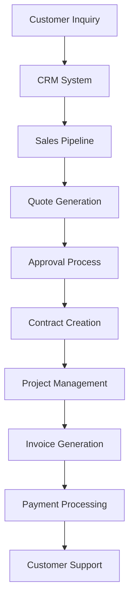

# ZeyOS Business Solutions

## Complete Component & Layout Showcase

**Modern business platform with comprehensive UI components**

---
layout: agenda
---

# Complete Reference Guide

1. **Layouts (17 total)** - Every available layout
2. **Components (15 total)** - All interactive components  
3. **Kawaii Components (8 total)** - Animated elements
4. **Light & Dark Versions** - Both color schemes
5. **Business Examples** - ZeyOS platform features

---
layout: section
---

# Business Solutions Platform

---
layout: default
---

# Default Layout

ZeyOS modern indigo/purple branding for business solutions.

- **Process automation** - Streamlined workflows
- **Customer management** - CRM integration
- **Resource planning** - ERP functionality  
- **Analytics dashboard** - Business intelligence

> Empowering businesses with intelligent automation

---
layout: two-cols
---

# Two Columns Layout

::left::

## Platform Features
- Workflow automation
- Customer portal
- Invoice management
- Reporting tools

::right::

## Integrations
- API connectivity
- Third-party apps
- Data synchronization
- Cloud services

---
layout: two-cols-title
---

# Two Columns with Title

## ZeyOS Platform Architecture

::left::

### Core Modules
- **CRM System** - Customer relationship management
- **ERP Integration** - Enterprise resource planning
- **Workflow Engine** - Business process automation
- **Analytics Suite** - Data visualization tools

::right::

### Technical Stack
- **Cloud Infrastructure** - Scalable architecture
- **API Gateway** - Secure integrations
- **Database Layer** - High-performance storage
- **Security Framework** - Enterprise-grade protection

---
layout: side-title
---

::title::
# Side Title Layout

Business Dashboard

::content::

## Key Performance Indicators

<CardGrid :cards="[
  { 
    title: 'Active Users', 
    content: '12,847 users online right now', 
    icon: 'fa-users',
    color: '#6366f1'
  },
  { 
    title: 'Monthly Revenue', 
    content: '€2.4M processed this month', 
    icon: 'fa-euro-sign',
    color: '#8b5cf6' 
  },
  { 
    title: 'Automation Tasks', 
    content: '45,230 workflows executed', 
    icon: 'fa-cogs',
    color: '#6366f1'
  },
  { 
    title: 'Customer Satisfaction', 
    content: '4.8/5 average rating', 
    icon: 'fa-star',
    color: '#8b5cf6'
  }
]" :columns="2" />

---
layout: top-title
---

# Top Title Layout

## Business Performance Metrics

| Metric | Current | Previous | Trend |
|--------|---------|----------|-------|
| Revenue | €2.4M | €2.1M | 📈 +14.3% |
| New Customers | 284 | 251 | 📈 +13.1% |
| User Engagement | 87% | 82% | 📈 +6.1% |
| System Uptime | 99.97% | 99.94% | 📈 +0.03% |

---
layout: top-title-two-cols
---

# Top Title Two Columns

## ZeyOS Business Intelligence

::left::

### Analytics Features
- **Real-time Dashboards** - Live business metrics
- **Custom Reports** - Tailored insights
- **Data Visualization** - Interactive charts
- **Predictive Analytics** - Forecast trends

### Automation Tools
- **Workflow Builder** - Drag-and-drop designer
- **Task Scheduling** - Automated processes
- **Notification System** - Smart alerts
- **Integration Hub** - Connect everything

::right::

### Customer Management
- **Contact Database** - Comprehensive profiles
- **Sales Pipeline** - Deal tracking
- **Support Tickets** - Issue management
- **Communication Hub** - Unified inbox

### Financial Tools
- **Invoice Generation** - Automated billing
- **Expense Tracking** - Cost management
- **Payment Processing** - Secure transactions
- **Financial Reporting** - Compliance ready

---
layout: full
---

# Full Layout

## Complete Business Platform

<SvgAnimation src="/svg/business-workflow.svg" />

**Integrated business solutions powered by intelligent automation**

---
layout: intro
---

# Intro Layout

Business solutions that scale with your growth

- Automated workflows
- Integrated systems
- Real-time analytics
- Expert support

---
layout: quote
---

# Quote Layout

> "ZeyOS has revolutionized how we manage our business processes. The automation capabilities have saved us countless hours and improved our efficiency dramatically."

**Marcus Weber**  
*CEO, InnovateTech GmbH*

---
layout: quotation
---

# Quotation Layout

"The best business platform is one that adapts to your unique processes, not the other way around."

**— ZeyOS Development Team**

---
layout: chart
---

# Chart Layout

## Business Process Flow

---
layout: four-cell
---

::cell1::
### CRM Integration
Comprehensive customer management

::cell2::
### Workflow Automation
Streamlined business processes

::cell3::
### Analytics Dashboard
Real-time business insights

::cell4::
### API Connectivity
Seamless integrations

---
layout: credits
---

# Credits Layout

## Development Team

- **ZeyOS Core Team** - Platform Architecture
- **UI/UX Designers** - User Experience
- **Backend Engineers** - System Integration
- **QA Team** - Quality Assurance

---
layout: thank-you
---

# Thank You Layout

Thank you for choosing ZeyOS Business Solutions

**Get Started Today:**
- 🌐 www.zeyos.com
- 📧 hello@zeyos.com
- 📞 +49 89 12345678

---
layout: section
color: dark
---

# Dark Theme Section

Business Intelligence in Dark Mode

---
layout: default
color: dark
---

# Dark Theme Default

ZeyOS platform looks stunning in both light and dark themes.

- **Enhanced focus** - Better for data analysis
- **Reduced eye strain** - Perfect for long work sessions
- **Modern aesthetics** - Professional dark interfaces
- **Energy efficient** - Battery-friendly on mobile devices

<Admonition type="info">
Dark themes are especially popular among developers and analysts who spend long hours working with data.
</Admonition>

---
layout: two-cols
color: dark
---

# Dark Theme Components

::left::

## Task Management

<TaskOverview :tasks="[
  { title: 'Customer Onboarding', description: 'Setup new client accounts', status: 'done', icon: 'fa-user-plus' },
  { title: 'Sales Report', description: 'Generate Q3 sales analytics', status: 'ongoing', icon: 'fa-chart-bar' },
  { title: 'System Update', description: 'Deploy latest platform features', status: 'pending', icon: 'fa-upload' },
  { title: 'User Training', description: 'Schedule team workshops', status: 'feedback', icon: 'fa-graduation-cap' }
]" layout="list" color="dark" />

::right::

## Team Communication

<SpeechBubble position="left" color="dark">
The new automation workflow is processing orders 40% faster!
</SpeechBubble>

<SpeechBubble position="right" color="dark" class="mt-4">
Excellent results! Customer satisfaction scores are up too.
</SpeechBubble>

---
layout: section
---

# Component Showcase

---
layout: default
---

# Card Grid Component

<CardGrid :cards="[
  { 
    title: 'Customer Management', 
    content: 'Comprehensive CRM system with contact management, sales pipeline, and customer support integration.',
    icon: 'fa-users',
    color: '#6366f1'
  },
  { 
    title: 'Process Automation', 
    content: 'Intelligent workflow automation that streamlines repetitive tasks and improves efficiency.',
    icon: 'fa-cogs',
    color: '#8b5cf6'
  },
  { 
    title: 'Business Analytics', 
    content: 'Real-time dashboards and reporting tools for data-driven business decisions.',
    icon: 'fa-chart-line',
    color: '#6366f1'
  },
  { 
    title: 'Financial Management', 
    content: 'Integrated invoicing, expense tracking, and financial reporting for complete oversight.',
    icon: 'fa-calculator',
    color: '#8b5cf6'
  },
  { 
    title: 'Team Collaboration', 
    content: 'Project management tools with task assignment, progress tracking, and team communication.',
    icon: 'fa-project-diagram',
    color: '#6366f1'
  },
  { 
    title: 'API Integration', 
    content: 'Seamless connectivity with third-party applications and custom development support.',
    icon: 'fa-plug',
    color: '#8b5cf6'
  }
]" :columns="3" />

---
layout: default
---

# Box Component Variations

<Box shape="s-s-2-10" color="zeyos" size="200px">
**Solid Border**
Customer data security
</Box>

<Box shape="r-d-3-20" color="zeyos" size="200px">
**Dashed Rounded**
Integration sandbox
</Box>

<Box shape="f-s-4-30" color="zeyos" size="200px">
**Full Circle**
User experience zone
</Box>

---
layout: default
---

# Sticky Notes & Email

<StickyNote color="zeyos">
**Platform Update!**
New automation features available in v2.4.1
</StickyNote>

<Email 
  to="team@zeyos.com"
  subject="Monthly Business Review"
  preview="Performance metrics and growth analysis for the current month..."
  color="zeyos"
/>

<StickyNote color="zeyos">
**Reminder**
Customer feedback session tomorrow at 2 PM
</StickyNote>

---
layout: default
---

# Admonition Components

<Admonition type="info">
**Platform Update**: New workflow automation features are now available. Check the admin panel for details.
</Admonition>

<Admonition type="warning">
**Maintenance Notice**: Scheduled system maintenance this Sunday 2-4 AM. Limited functionality during this time.
</Admonition>

<Admonition type="success">
**Feature Release**: Advanced analytics dashboard is now live! Access it from the main navigation menu.
</Admonition>

<Admonition type="error">
**Service Alert**: Payment gateway experiencing intermittent issues. Engineering team investigating.
</Admonition>

---
layout: default
---

# Kawaii Components - Business Theme

<Cat mood="excited" :size="120" color="#6366f1" />
**Happy Customers**
Satisfaction guaranteed!

<Browser mood="happy" :size="120" color="#8b5cf6" />
**Web Platform**
Always accessible

<Mug mood="blissful" :size="120" color="#6366f1" />
**Productivity Boost**
Fuel for success

<Ghost mood="sad" :size="120" color="#8b5cf6" />
**Manual Processes**
We automate these!

---
layout: default
---

# More Kawaii Components

<BackPack mood="happy" :size="120" color="#6366f1" />
**Mobile Solutions**
Business on-the-go

<IceCream mood="excited" :size="120" color="#8b5cf6" />
**Cool Features**
Latest innovations

<Planet mood="blissful" :size="120" color="#6366f1" />
**Global Platform**
Worldwide access

<CreditCard mood="happy" :size="120" color="#8b5cf6" />
**Payment System**
Secure transactions

---
layout: default
---

# Line & Arrow Components

<Line 
  x1="10%" y1="20%" 
  x2="90%" y2="20%" 
  color="#6366f1" 
  width="3"
  style="dashed"
/>

<ArrowDraw 
  x1="10%" y1="50%" 
  x2="90%" y2="50%" 
  color="#8b5cf6"
  width="4"
/>

<VDragLine 
  x1="50%" y1="10%" 
  x2="50%" y2="90%" 
  color="#6366f1"
  width="2"
/>

**Business Process Flow**

**System Architecture**

---
layout: default
---

# Arrow Heads & Thumb Components

<ArrowHeads direction="up" color="#6366f1" :size="60" />
**Revenue Growth**
+24% this quarter

<ArrowHeads direction="down" color="#8b5cf6" :size="60" />
**Processing Time**
-45% reduction

<Thumb direction="up" color="#6366f1" :size="80" />
**User Satisfaction**
4.8/5 rating

<Thumb direction="down" color="#8b5cf6" :size="80" />
**Support Tickets**
Minimal issues

---
layout: default
---

# Credit Scroll Component

<CreditScroll 
  :credits="[
    { role: 'Platform Architect', name: 'Alexander Schmidt', company: 'ZeyOS' },
    { role: 'UX Designer', name: 'Maria Gonzalez', company: 'ZeyOS' },
    { role: 'Backend Developer', name: 'Thomas Mueller', company: 'ZeyOS' },
    { role: 'Frontend Developer', name: 'Sarah Johnson', company: 'ZeyOS' },
    { role: 'Product Manager', name: 'David Wilson', company: 'ZeyOS' }
  ]"
  speed="2"
  color="zeyos"
/>

---
layout: thank-you
---

# ZeyOS - Complete

**All components and layouts showcased!**

- ✅ 17 Layouts demonstrated
- ✅ 15 Components featured  
- ✅ 8 Kawaii elements included
- ✅ Light & Dark themes shown
- ✅ ZeyOS branding throughout

**Start your business transformation:**
🌐 www.zeyos.com | 📧 hello@zeyos.com